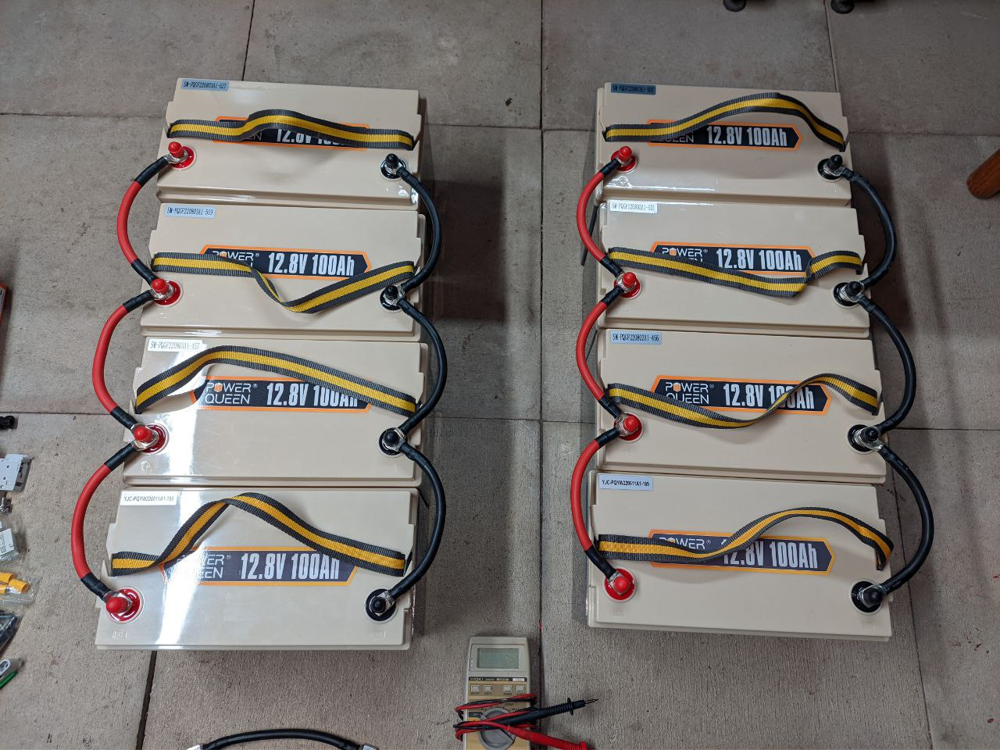

## Solar Plant
   **Solarplant**

   Surge protection and solar panel main switch.  
   

   Battery synchronisation  
   

   Solar plant circuit  
   

   Solar plant battery pack  
   

   Solar plant  
   

   Victron Smart battery monitor  
   

   Victron Smart MPPT  
   

   Tasmota / Sonoff Power meter Elite  
   

### Description
   The goal of this  

### Disclaimer
   I don't take any responsibility nor liability for using this software nor for the 
   installation or any tips, advice, videos, etc. given by any member of this site or any related site.

### License
   This program is licensed under GPL-3.0

### Circuit
   

### Function

### Part-list

### Shopping list

### Thanks
