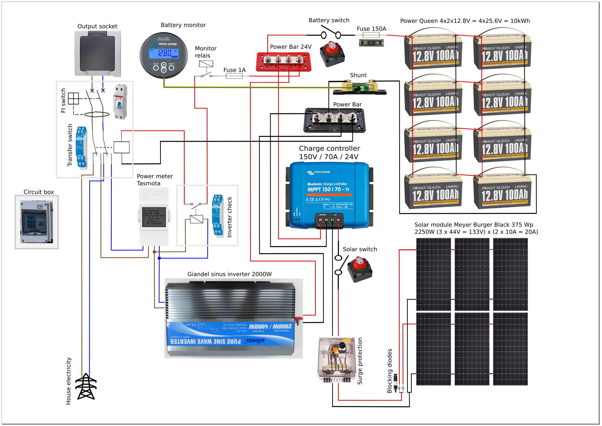
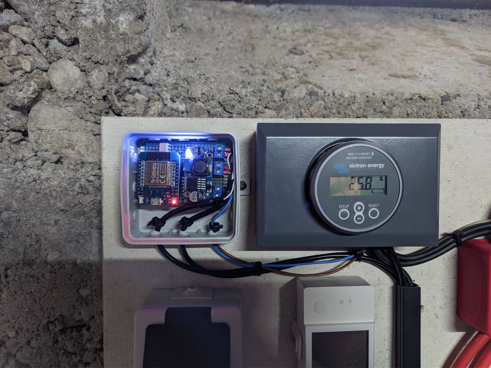
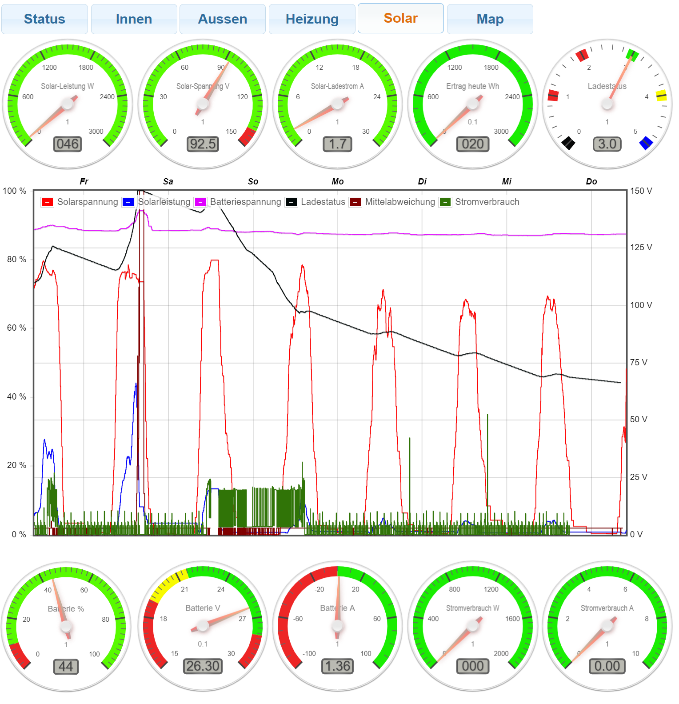

## Off Grid Solar System
   **Solar system for use as an emergency power supply with automatic switching to mains power in case of lack of solar 
     power with display on an E-Ink display via MQQT.**

### Description
   The goal of this facility was to ask; what happens in the event of a power outage.  
   Which electrical devices in the house are the most critical here and should continue to function in this case.
   At least for some time.  
   In my case, this would be the freezers and the oil heating.
   A continued functioning of the solar circulation pump would also be beneficial.  
   What good are hundreds of liters of heating oil in the tank if the house remains cold because of the 200W that the oil burner needs.  
   On television, computer and also the short-time cooking on an electric stove should be able to be renounced to the emergency.  
   In addition, this system should monitor the battery capacity and in case the sun does not shine enough automatically switch to house power.  
   And since I am a Tasmota and ESP fan, the whole thing should be additionally monitored via E-Ink display and MQQT via my IoBroker.

### Disclaimer
   I don't take any responsibility nor liability for using this software nor for the 
   installation or any tips, advice, videos, etc. given by any member of this site or any related site.  
   Attention this plant is in the making and not yet tested.
   In particular, the behavior in summer months and the interaction with the batteries has not yet been tested by me
   extensively tested in practice. 

### Safety aspects
  * [Some thoughts about security](docs/SafetyAspects.md)

### Circuit
   Circuit diagram with pictures of the components   
   

   Circuit diagram with real components on the control panel
     
   Manuals of the components: See manuals folder

### Pictures of the solar panels and installation
   

  * [See pictures of the installation](docs/TheSolarInstallation.md)

### Victron Modules and Settings
  * [See Victron modules and settings](docs/Victron.md)

### Power consumption monitoring with Tasmota
  * [See Tasmota (Sonoff) Elite 20A](docs/Tasmota.md)

### Victron MQQT Bridge
   
   IoBroker View: Not beautiful but everything on it  
   
  * [See Victron to IoBroker MQQT Bridge](docs/VictronMQQTBridge.md)

### Wall mounted status display via  E-Ink display (M5Paper)
   
  * [See Status display](docs/StatusDisplay.md)

### Shopping list
  * [See Shopping list](docs/ShoppingList.md)

### License
   This program is licensed under GPL-3.0

### Thanks
   * Thanks to 'Power Queen' for the great support and advice.
   * https://www.arduino.cc
     *Thanks to the Arduino community with all its incredible possibilities and support.** 
   * https://github.com/arendst/Sonoff-Tasmota
     *Thanks to Theo Arends for his great home automation software project with all the detailed esp functionality.*
   * http://fritzing.org/home
     *Thanks to the fritzing team for this very intuitive usable software.* 
     I could create my circuit in Fritzing with only a half day.
   * And a special thanks to the support of the local electrician for advice on solar issues and for the 
     Ordering electrical components like cables, surge protectors and solar panels.
     And many thanks for the energetic support of my brother in pulling cables, assembling
     components and also for the good advice.
   