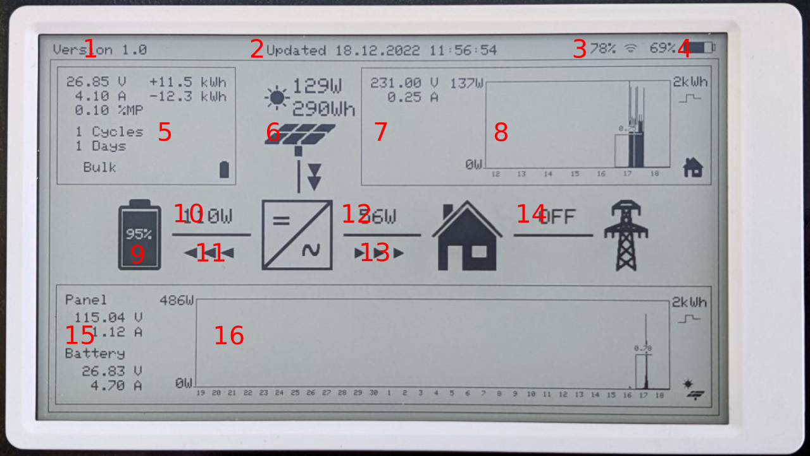
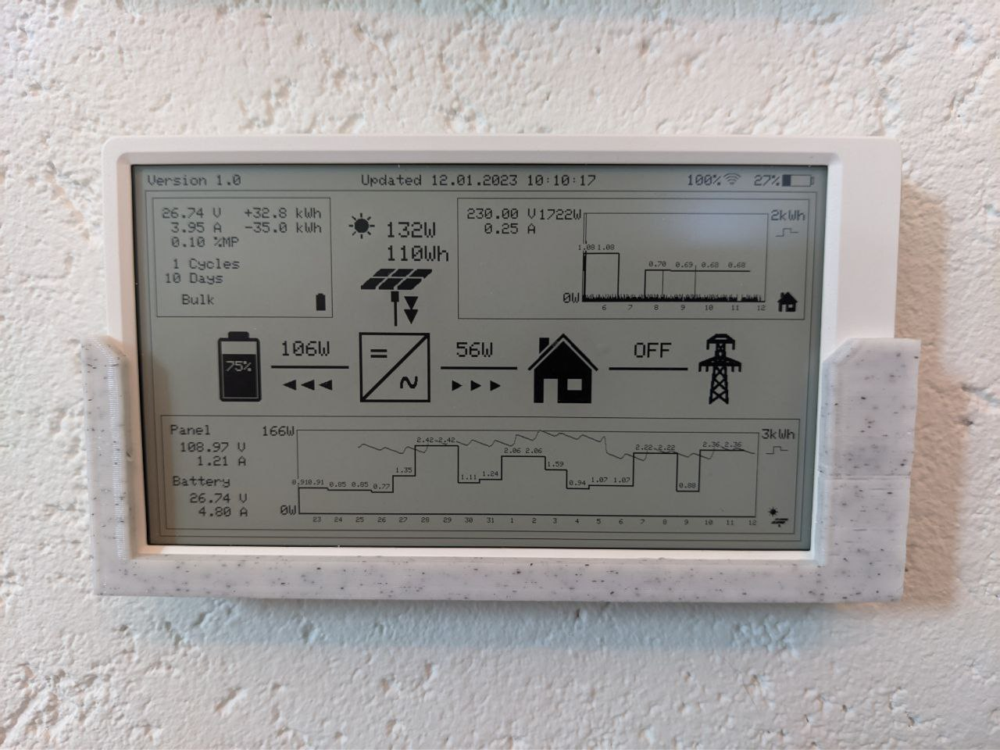
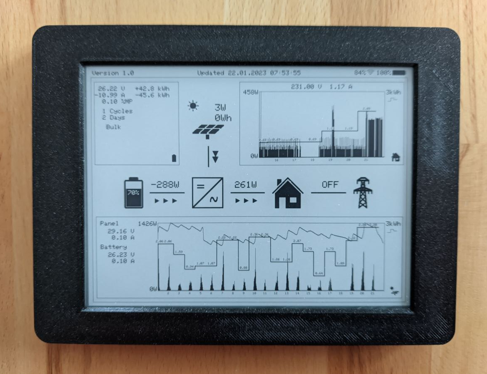

## Status display via  E-Ink display (M5Paper)

### Monitor description

The entire solar system should have a display on which all important status messages and values are visible.  
In addition, two diagrams about the power curve should be displayed.  
By simple symbols it should be directly recognizable in which direction the power is currently flowing and  
whether a connection is switched on or off.  
If errors occur in the battery monitor module or the charge controller,  
these should be displayed with priority.
Furthermore, it should be visible if the data is no longer supplied by the IoBroker or if it is outdated.  

Here is the description of each area.

|Label |Description |
|------|------------|
|  1 | Internal monitor version. |
|  2 | The date and time of the last display update. |
|  3 | The strength of the wifi connection with value and symbol. |
|  4 | The current state of charge of the battery with value and symbol. |
|  5 | All detailed information of the battery monitor (Victron BMV-712).
|                                    | - The current voltage |
|                                    | - The current charge or discharge current |
|                                    | - The deviation of the average point voltage |
|                                    | - How much charge was charged in total |
|                                    | - How much charge has been removed in total |
|                                    | - The number of charge cycles |
|                                    | - How many days since the last full charge |
|                                    | - The current charging mode |
|                                    | In case of an error, the problem is displayed here instead. |
|  6 | Display of the solar panel icon with the current watt and the power gained today |
|  7 |  The details of output power monitoring (Tasmota Elite) |
|                                    | - Grid voltage |
|                                    | - Current current consumption |
|  8 | Statistical data of consumed energy for the last 7 days (watts and kWh) |
|  9 | The battery icon with the current charge level |
| 10 | The current charging (+) or discharging (-) power. |
| 11 | Arrow direction of loading or unloading |
| 12 | The current energy going to the end users. |
| 13 | The arrows indicate whether the final consumers are supplied by the solar system. |
| 14 | The arrows indicate whether the end users draw power from the grid otherwise 'OFF'. |
| 15 | All detailed information of the charge controler (Victron MPPT 150/70). |
|                                    | The voltage of the solar panels |
|                                    | The delivered current of the solar panels |
|                                    | The current battery charging voltage |
|                                    | The current battery charging current |
| 16 | Statistical data of the charge controller in watts and kWh and the battery charge. |

### Wall mount

And here the whole thing with a wall mount made by 3D printing

   See https://www.thingiverse.com/thing:4767014  
   

### Inplate 6 Plus version

   I have also ported the M5Paper version to Inkplate 6 Plus for testing.
   
