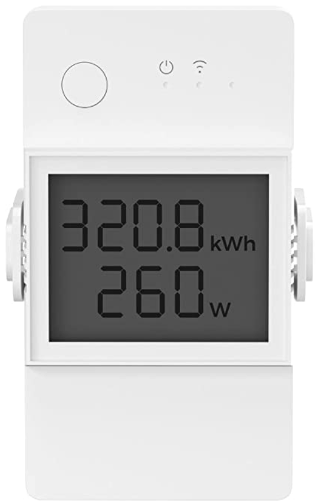
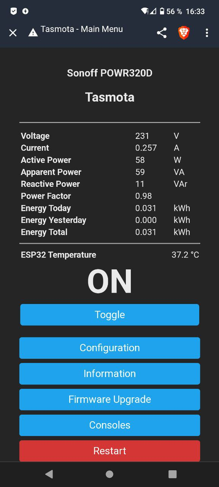

### Tasmota (Sonoff) Elite

To monitor power usage, I reflashed a Sonoff POW320D with the Tasmota software.  
This module has an integrated LCD display of the power values and can send the data to my IoBroker via Mqtt.

A good description how to write the tasmota software to the Sonoff can be found here:  
https://bangertech.de/sonoff-pow-elite/

The display directly via Wifi then looks something like this  
   
