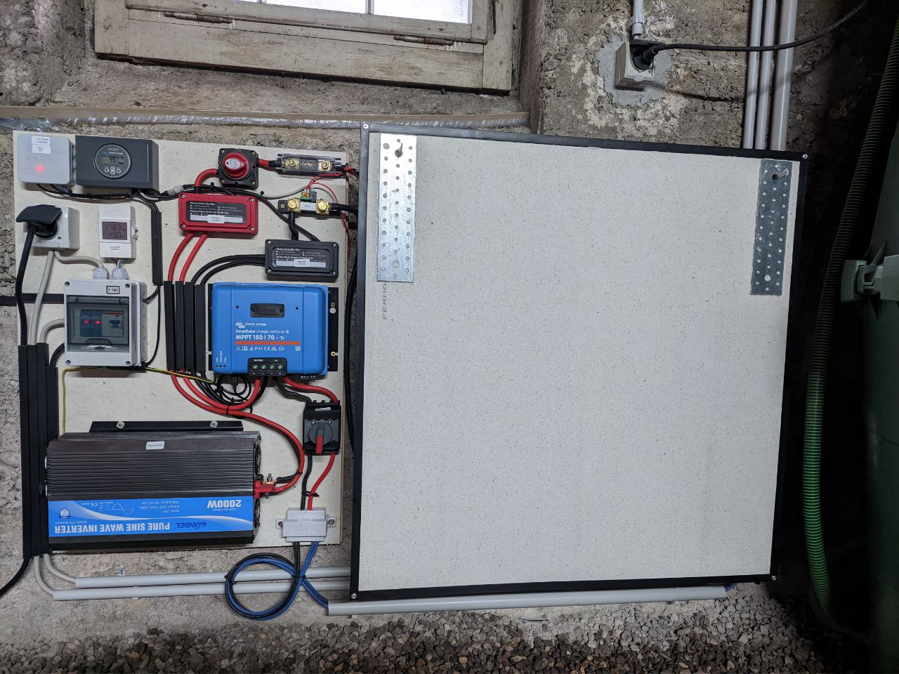
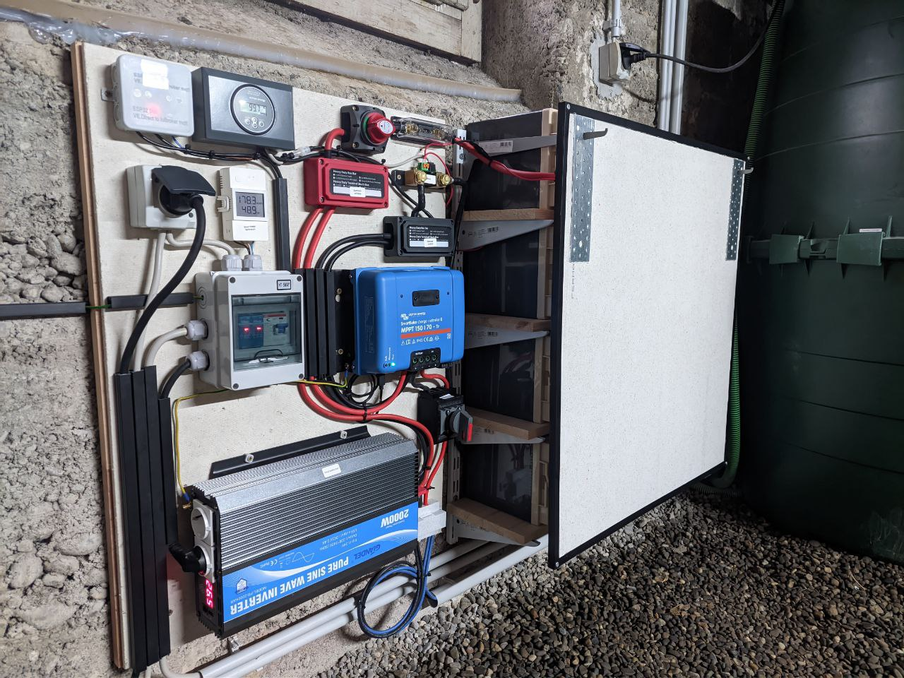
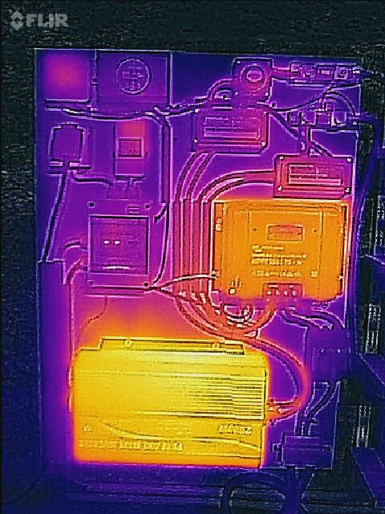
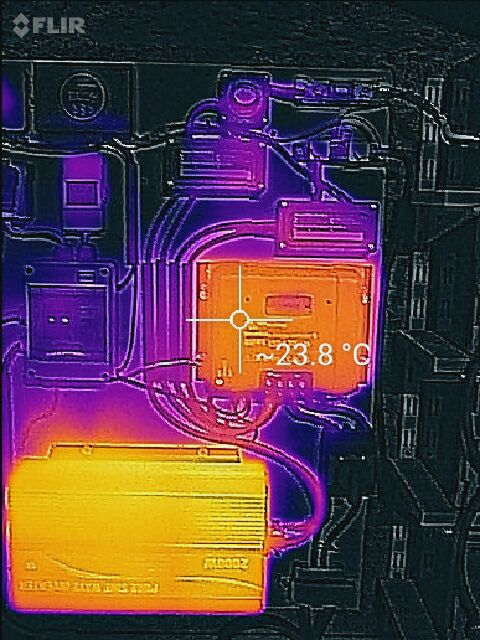
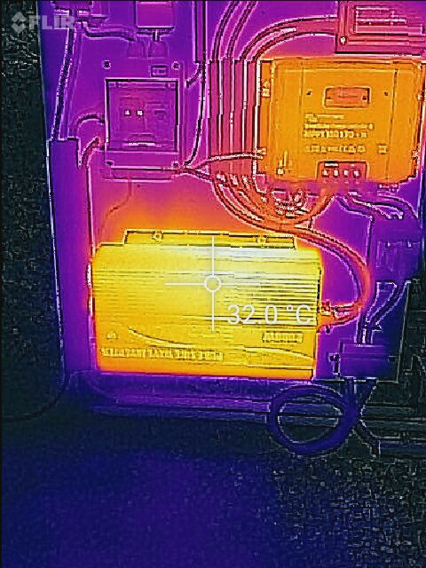

### Pictures of the solar installation

   Solar panels.  
   The final 6 xMeyer Burger solar panels.
   

   Surge protection and solar panel main switch.  
   

   Solar installation circuit  
   

   Solar installation battery pack  
   

   Solar installation with battery pack
   
   

   The pols of the batteries must be covered from accidental contact.
   
   

   Thermo images ofv the circuit in action.  
   
   
   

   Solar Circuit Breaker Cover Box
   The circuit breaker needs a touch-proof cover
   

