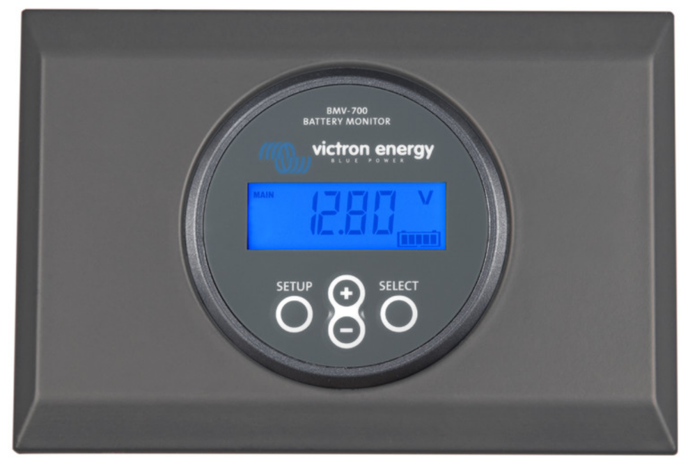
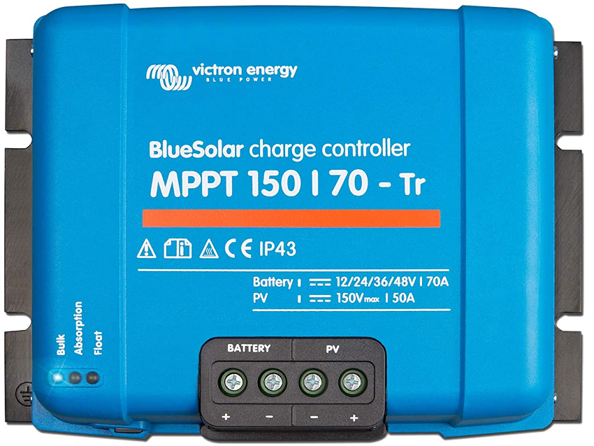
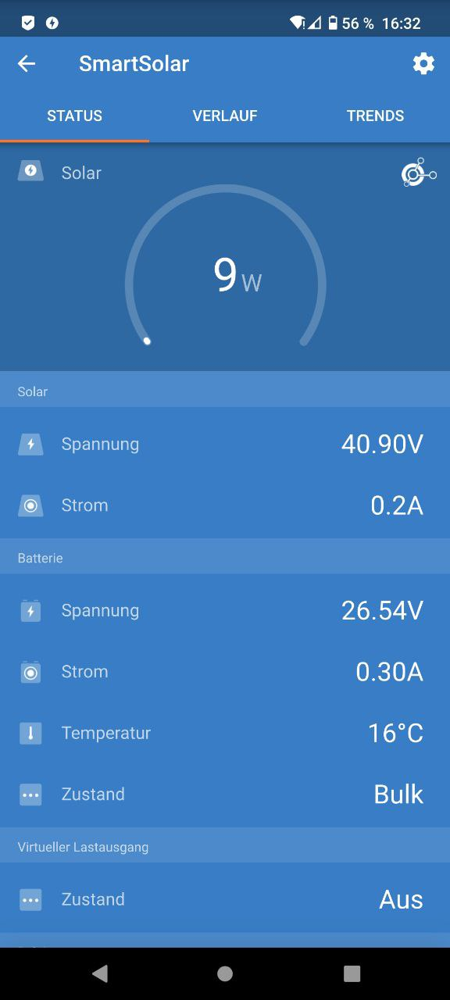

### Victron Modules and Settings

I use 2 modules from Victron.
A charge controller (SmartSolar MPPT 150/70) to bring the solar energy of the solar panels into the battery and  
 a battery monitor (Smart BMV-712) that monitors the state of charge of my batteries by means of a shunt.

Victron BMV-712 with enhousing  

Victron BMV-712 shunt  

Victron Smart Battery Monitor  

Victron Smart MPPT 150/70  

Victron Smart MPPT Monitor  

### Smart MPPT 150/70 Settings

|Name |Value |Description  |
|-----|------|-------------|
|Battery voltage |24V |2 times each Power Queen Lifepo4 Battrien in series |
|Max charge current | 70A | The Power Queen batteries can handle max 100A charge currents but the charge controller can only handle max 70A |
|Charger enabled | enabled | To safe the power in the batteries |
|Battery preset | Power Queen | I make a copy of the LiFePo4 settings and have given their own name 'Power Queen'. |
|Absorption voltage | 28.8V | In the description of Power Queen it says 'Recommended charging voltage 14.2V to 14.6V therefore 2 times 14.4V = 28.8V |
|Float voltage | 27.6V | In the description of Power Queen it says 'float charge voltage 13.8V therefore 2 times 13.8V = 27.6V |
|Equalization voltage | disabled | Disabled for LiFePo4 battries |
|Expert settings |  |  |
|Re-bulk voltage offset | 1.8V | Recommend 27V for re-bulk so it will be 28.8V - 1.8V = 27V. |
|Absorption duration | adaptive | Recommend adataptive for Power Queen |
|Absorption time | 2h | Should be enough |

### Smart BMV-712 Settings

|Name |Value |Description  |
|-----|------|-------------|
|Battery capacity | 400Ah | 4 x 2 x 100Ah Power Queen LiFePo4 batteries = 400Ah |
|Charged voltage | 27V | According to the Power Queen documentation, the voltage at 100% is 13.5V, i.e. times 2 = 27V. |
|Discharge floor | 20% | LiFePo4 batteries can be discharged up to 20%. |
|Tail current | 2.0% | 2% at 400Ah = 8A should be enough to switch to float. |
|Charged detection time | 3m | Should be enough. |
|Peukert exponent | 1.05 | Special value for LiFePo4 batteries. |
|Charge efficiency factor | 99% | Special value for LiFePo4 batteries. |
|Current threshold | 0.10A | Default for LiFePo4 batteries. |
|Time-to-go averaging period | 12m | Especially maximum (12m) since in refrigerators very changeable power demand. |
|Relais settings |  |  |
|Relais-Modus | Standard |  |
|Relais inverted | yes | In the event of a battery power failure, the system automatically switches to mains power. |
|Relay low charge | 10% - 90% | I.e. if the battery charge drops below 10% then the relay opens and the system goes on mains power until the charge is back to 90%. |

