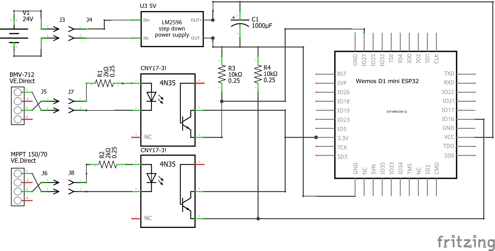
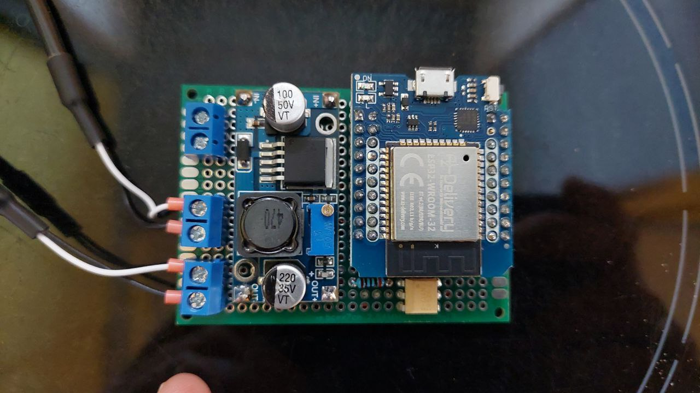
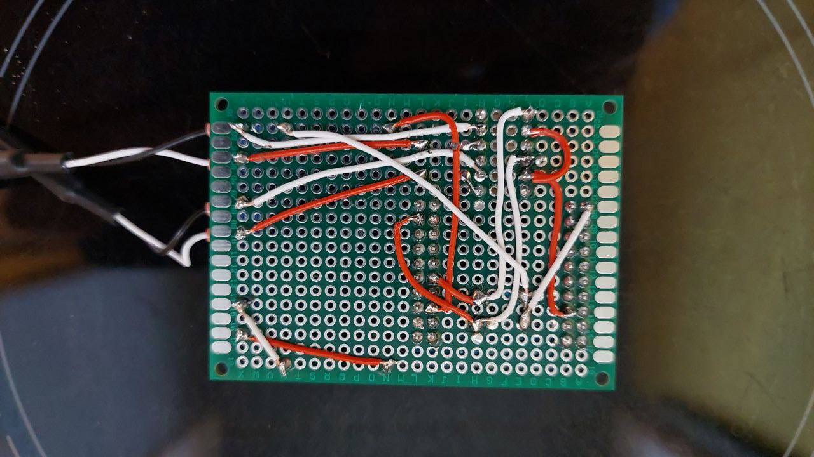
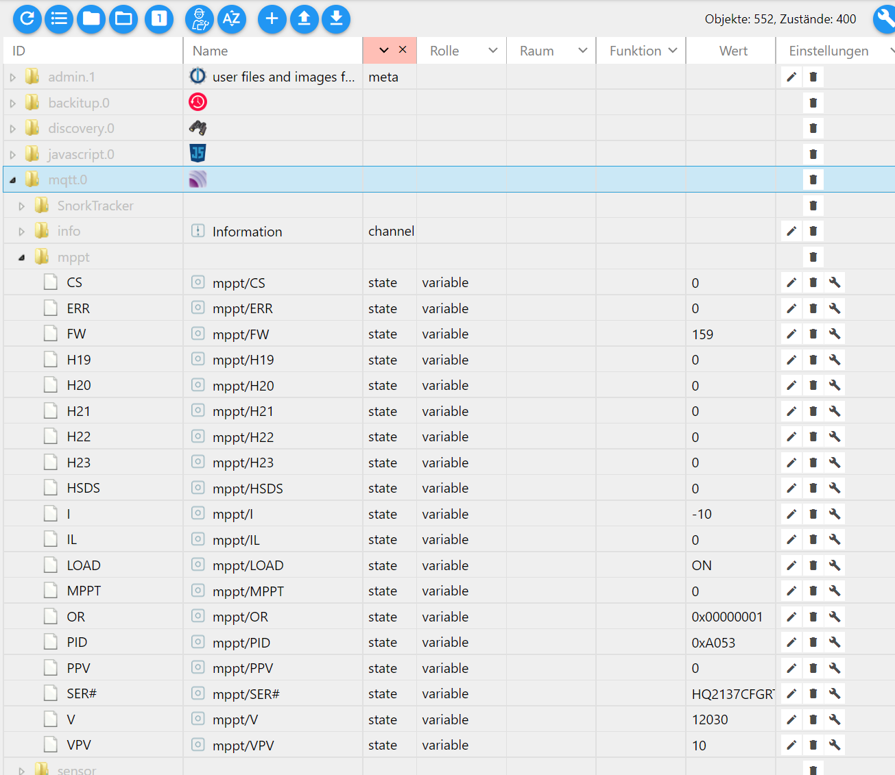


### Victron MQQT Bridge

   **A bridge to send all the victron ve.direct data to my IoBroker via MQQT**
   
   The bridge should be connected by optocouplers galvanically isolated to both Victron devices, 
   the MPPT charge controller and the battery monitoring device.

   The software should read both ve.direct ports, respect the checksum so that no data garbage 
   arrives at my IoBroken and then send only every 10 seconds to the ioBroker.

   Circuit diagram with pictures of the components   
   
   I had problems with the 4N35 optocoupler but with the CNY17-3 it works fine.  
   And very important: The LM2596 is great but the output voltage must be smoothed, 1000μF is a bit much but never mind.

   Finished Board  
   

   
   I used a Victron VE.Direct TX digital output cable.

   On the subject of connecting the ve.direct interface via Optocopler, I found this page. 
   https://www.tarthorst.net/victron-ve-direct/  
   Thank you for this example.  
   I have modified it a bit, I now switch the 3.3V input then I do not have to invert the signal.  
   And I tested the series resistor. It works best with 2k ohms at the optocoupler input and 10k ohms at the ESP32 input

   The box at the solar installation
   

   The data packets arrive in my IoBroker.
   

   IoBroker View: Not beautiful but everything on it  
   
